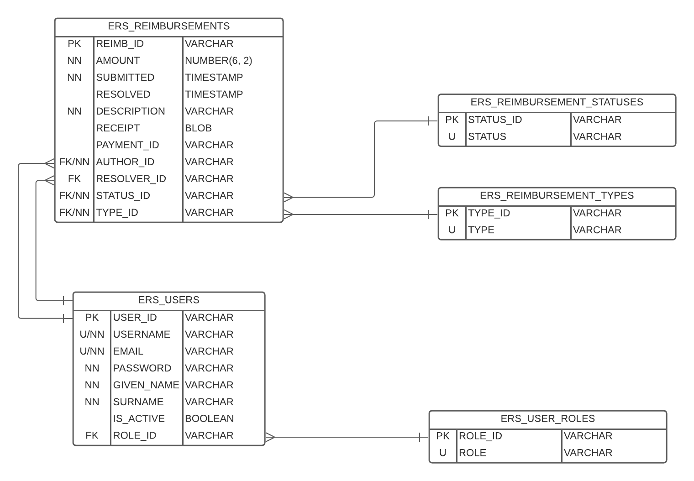

# P1-brayan-hal
### Project 1 Belonging To Brayan and Hal

## Project Description
This project allows for employees to request a reimbursement with a specific category after the request has been submitted
the finance manager will be able to view and edit requests by approving or denying the reimbursement request. There is also
an adming that can override a users' password and approve a users' registration.

### Brief

You are tasked with building an API that will support a new internal expense reimbursement system. 
This system will manage the process of reimbursing employees for expenses incurred while on company time. Which is used for processing payments to employees. 
All registered employees in the company can login and submit requests for reimbursement and view their past tickets 
and pending requests. Finance managers can log in and view all reimbursement requests and past history for 
all employees in the company. Finance managers are authorized to approve and deny requests for expense reimbursement.

### Roles
- Admin
- Finance Manager
- Employee

## Technologies
- PostgreSQL
- Java 8
- Apache Maven
- JDBC
- Java EE Servlets
- JSON Web Tokens
- JUnit

## ER diagram

